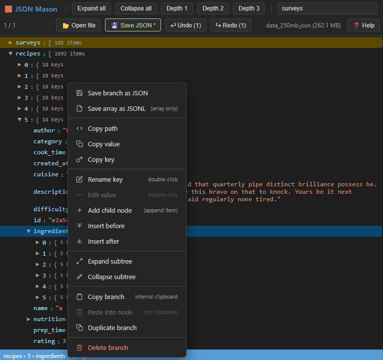

# 🧱 JSON Mason
## A lightweight JSON viewer, builder and editor. 
###### Use your browser to view, build and edit JSON files.

### Aims:

* Single HTML file that can work on many platforms.
* Lightweight.

### Reasons for building JSON Mason: 

* Offline viewing and editing of sensitive JSON data.
* Single HTML file has no dependencies. Source can be viewed in a text editor.
* Most editors struggle with larger JSON files.

### Usage: 

* Open jsonmason.html (in browser). Drag/drop your JSON file or use file explorer to open JSON file. Additional help is available in the app.

### Screenshot: 

 
 
### Citation: 

* Some of this code was generated with AI.

